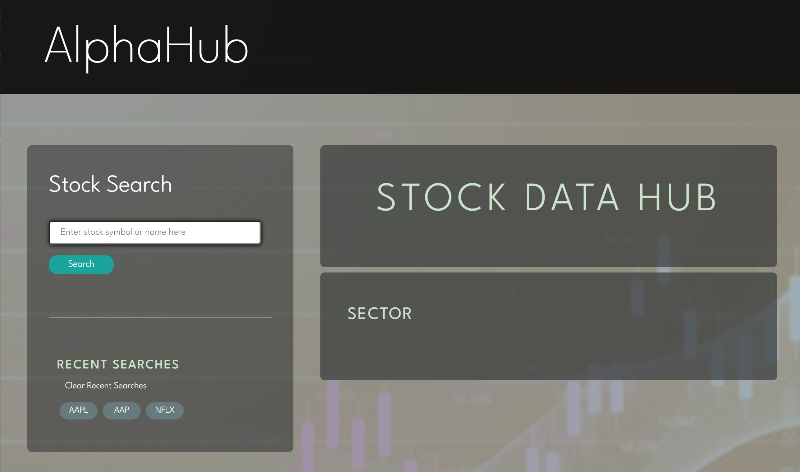

# AlphaHub

https://dannyjunlee.github.io/alpha-hub/
 

## Description

This application is designed for users interested in starting to invest in stocks and looking to build a diversified portfolio (diversified referring to a portfolio of stocks consisting of diverse backgrounds/origin/classification/etc.). This tool helps users by presenting them with data for the stock they searched along with stocks from the S&P500 that align with the same sector, allowing the user to look through related stocks. The application is not designed for a user looking to conduct more advanced/in-depth analysis of stocks, as we simply provide cursory information in a format that is accessible to the beginner investor and in a way that is not easily found elsewhere (at least for free).

## Usage
 

The user is greeted with a simple interface with an input box to enter the stock the user would like to see data for. The input box has an autocomplete function so that the user knows which stocks are valid choices.
 

When the user selects a valid stock and submits using the search button that stock's data is presented, including the symbol, data date, open, close, high, low, and volume for that date (previous day's final information).
 

The searched stock is also added to the recent searches list for easy access in the future.
 

Upon searching a stock a list of all related S&P500 stocks of the same sector appear which the user can also click on in order to view that stock's data.
 

 

## Credits

This application utilizes the Polygon.io and DataHub.io server-side API's to acquire stock data and match the stocks with others in the same sector.
It incorporated fonts from Google Fonts and CSS Framework styling for the search button and autocomplete list from PureCSS.io and jQueryUI.com.

## License

MIT License

Copyright (c) 2022 Valeria Alarcon, Joshua Espinal, Veronica Garcia, Jackson Impellizeri, Danny Jun Lee

Permission is hereby granted, free of charge, to any person obtaining a copy
of this software and associated documentation files (the "Software"), to deal
in the Software without restriction, including without limitation the rights
to use, copy, modify, merge, publish, distribute, sublicense, and/or sell
copies of the Software, and to permit persons to whom the Software is
furnished to do so, subject to the following conditions:

The above copyright notice and this permission notice shall be included in all
copies or substantial portions of the Software.

THE SOFTWARE IS PROVIDED "AS IS", WITHOUT WARRANTY OF ANY KIND, EXPRESS OR
IMPLIED, INCLUDING BUT NOT LIMITED TO THE WARRANTIES OF MERCHANTABILITY,
FITNESS FOR A PARTICULAR PURPOSE AND NONINFRINGEMENT. IN NO EVENT SHALL THE
AUTHORS OR COPYRIGHT HOLDERS BE LIABLE FOR ANY CLAIM, DAMAGES OR OTHER
LIABILITY, WHETHER IN AN ACTION OF CONTRACT, TORT OR OTHERWISE, ARISING FROM,
OUT OF OR IN CONNECTION WITH THE SOFTWARE OR THE USE OR OTHER DEALINGS IN THE
SOFTWARE.
